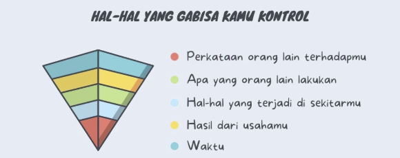
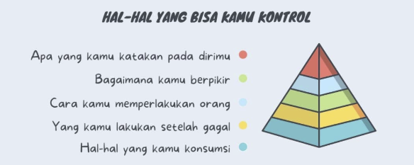

## Mindset is Powerfull

Gambar tersebut membahas tentang dua jenis hal dalam hidup: 

### Hal-hal yang Tidak Bisa Kita Kontrol
Hal-hal yang tidak bisa kamu kontrol dan hal-hal yang bisa kamu kontrol. Dalam hidup, ada banyak hal yang berada di luar kendali kita, seperti: 

- Perkataan orang lain terhadap kita, 
- Tindakan orang lain, 
- Kejadian di sekitar kita, 
- Hasil dari usaha yang kita lakukan, 
- dan bahkan Waktu. 

Terlalu fokus pada hal-hal ini bisa membuat kita merasa frustasi, cemas, dan tidak berdaya karena kita tidak bisa mengubah atau memengaruhinya secara langsung.

### Hal-hal yang Dalam Kendali Kita

Sebaliknya, gambar ini mengingatkan bahwa ada hal-hal yang sepenuhnya berada dalam kendali kita. Contohnya adalah 

- Apa yang kita katakan pada diri sendiri (self-talk), 
- Cara kita berpikir, 
- Bagaimana kita memperlakukan orang lain, 
- Bagaimana kita merespons kegagalan, 
- Serta apa yang kita konsumsi. 

Dengan memfokuskan energi dan perhatian pada hal-hal yang bisa kita kontrol, kita bisa membangun kehidupan yang lebih sehat secara mental dan emosional. Ini adalah prinsip penting dalam pengembangan diri dan kesehatan psikologis: `lepaskan yang di luar kendali`, dan `maksimalkan yang bisa kamu lakukan`.