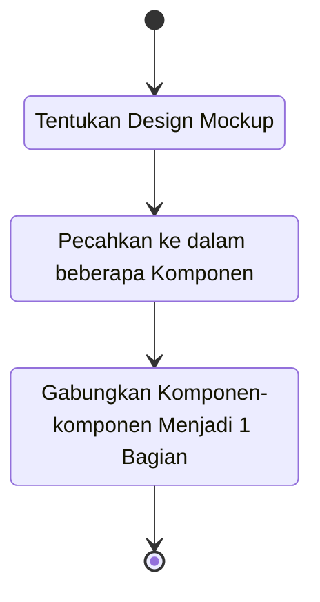

# Konsep Dasar Build React App

Konsep dasarnya adalah, dalam mengembangkan aplikasi dengan `React` kita perlu mengubah cara berfikirnya `Basic Mindset`, tentang design yang sudah di buat dalam bentuk `Mock up` kemudian kita pecahkan ke beberapa komponen



### 1. Tentukan Design Mockup & Data Sampling

```.json
[
  { kategori: "Deterjen", harga: "5000", stock: 10, name: "Rinso Cair" },
  { kategori: "Mie Instan", harga: "7500", stock: 3, name: "Indomie Goreng" },
  { kategori: "Pewangi", harga: "3000", stock: 20, name: "Downy Lavender" },
]
```

Design mock up yang akan kita buat adalah sebagai berikut


### 2. Pecahkan ke dalam beberapa Komponen

Partisi beberapa komponen seperti pada gambar berikut


### 3.  Gabungkan Komponen-komponen Menjadi 1 Bagian

Gabungkan menjadi 1 bagian, dari komponen-komponen yang sudah kita kelompokan sebelumnya, untuk selanjutnya kita akan praktikan langsung pembuatan komponen dengan real case

**To be continued...**